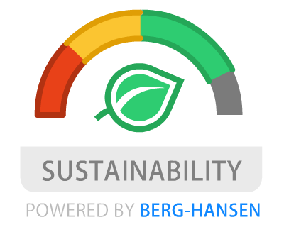

<div align="center">
	
	<br>
	<br>
</div>
<br>

<div align="center">
	<b>Help people make sustainable travel decisions, and the travel industry to take responsibility for sustainability.</b>
</div>

<br>
<br>

<p align="center">
	<a href="https://www.facebook.com/events/247752976176734/permalink/251695315782500/">The Hackathon Details</a>&nbsp;&nbsp;&nbsp;
	<a href="https://www.un.org/sustainabledevelopment/sustainable-development-goals/">FNs Sustainable Development Goals</a>
</p>

<p align="center">
	<sub>This event and topic was set by <a href="https://awesome.re"><code>Berg-Hansen</code></a>. Leading the way towards more sustainable travel.</sub>
</p>
<br>


## Contents

- [Support](#support)
- [Tooling](#tooling)
- [Installation](#installation)
- [Development](#development)
- [Build](#build)
- [Compress](#compress)
- [Test](#test)
- [Contributing](#contributing)
    -   [Pull Request Process](#pull-request-process)
    -   [Code of Conduct](#code-of-conduct)
        -   [Our Pledge](#our-pledge)
        -   [Our Standards](#our-standards)
        -   [Our Responsibilities](#our-responsibilities)
- [License](#license)


## Support

Currently only one site is supported. You can check it out by clicking on the link below. This will give you an idea of how the solution is intended to work. We need more people to chip in and make it a reality, so any contribution is highly appreciated.

 - Round-Trip results page of [Berg-Hansen Trip Search](https://www.berg-hansen.no/privat/vare-turer/) - just do the search, and watch the magic happen.


## Tooling

We've chosen state-of-the-art tooling to make your development experience a pleasure.

 - Simple [React](https://github.com/facebook/react)/[Redux](https://github.com/rackt/redux) examples of Chrome Extension Window & Popup & Inject pages
 - Hot reloading React/Redux (Using [Webpack](https://github.com/webpack/webpack) and [React Transform](https://github.com/gaearon/react-transform))
 - Write code with ES2015+ syntax (Using [Babel](https://github.com/babel/babel))
 - E2E tests of Window & Popup & Inject pages (Using [Chrome Driver](https://www.npmjs.com/package/chromedriver), [Selenium Webdriver](https://www.npmjs.com/package/selenium-webdriver))

## Installation

```bash
# clone it
$ git clone https://github.com/jhen0409/react-chrome-extension-boilerplate.git

# Install dependencies
$ npm install
```

## Development

* Run script
```bash
# build files to './dev'
# start webpack development server
$ npm run dev
```
* If you're developing Inject page, please allow `https://localhost:3000` connections.
* [Load unpacked extensions](https://developer.chrome.com/extensions/getstarted#unpacked) with `./dev` folder.


## Build

```bash
# build files to './build'
$ npm run build
```

## Compress

```bash
# compress build folder to {manifest.name}.zip and crx
$ npm run build
$ npm run compress -- [options]
```

#### Options

If you want to build `crx` file (auto update), please provide options, and add `update.xml` file url in [manifest.json](https://developer.chrome.com/extensions/autoupdate#update_url manifest.json).

* --app-id: your extension id (can be get it when you first release extension)
* --key: your private key path (default: './key.pem')  
  you can use `npm run compress-keygen` to generate private key `./key.pem`
* --codebase: your `crx` file url

See [autoupdate guide](https://developer.chrome.com/extensions/autoupdate) for more information.

## Test

* `test/app`: React components, Redux actions & reducers tests
* `test/e2e`: E2E tests (use [chromedriver](https://www.npmjs.com/package/chromedriver), [selenium-webdriver](https://www.npmjs.com/package/selenium-webdriver))

```bash
# lint
$ npm run lint
# test/app
$ npm test
$ npm test -- --watch  # watch files
# test/e2e
$ npm run build
$ npm run test-e2e
```

## Contributing
Please note we have a code of conduct, please follow it in all your interactions with the project.

### Pull Request Process

1. Ensure any install or build dependencies are removed before the end of the layer when doing a 
   build.
2. Update the README.md with details of changes to the interface, this includes new environment 
   variables, exposed ports, useful file locations and container parameters.
3. Increase the version numbers in any examples files and the README.md to the new version that this
   Pull Request would represent. The versioning scheme we use is [SemVer](http://semver.org/).
4. You may merge the Pull Request in once you have the sign-off of two other developers, or if you 
   do not have permission to do that, you may request the second reviewer to merge it for you.

### Code of Conduct

#### Our Pledge

In the interest of fostering an open and welcoming environment, we as
contributors and maintainers pledge to making participation in our project and
our community a harassment-free experience for everyone, regardless of age, body
size, disability, ethnicity, gender identity and expression, level of experience,
nationality, personal appearance, race, religion, or sexual identity and
orientation.

#### Our Standards

Examples of behavior that contributes to creating a positive environment
include:

* Using welcoming and inclusive language
* Being respectful of differing viewpoints and experiences
* Gracefully accepting constructive criticism
* Focusing on what is best for the community
* Showing empathy towards other community members

Examples of unacceptable behavior by participants include:

* The use of sexualized language or imagery and unwelcome sexual attention or
advances
* Trolling, insulting/derogatory comments, and personal or political attacks
* Public or private harassment
* Publishing others' private information, such as a physical or electronic
  address, without explicit permission
* Other conduct which could reasonably be considered inappropriate in a
  professional setting

#### Our Responsibilities

Project maintainers are responsible for clarifying the standards of acceptable
behavior and are expected to take appropriate and fair corrective action in
response to any instances of unacceptable behavior.

Project maintainers have the right and responsibility to remove, edit, or
reject comments, commits, code, wiki edits, issues, and other contributions
that are not aligned to this Code of Conduct, or to ban temporarily or
permanently any contributor for other behaviors that they deem inappropriate,
threatening, offensive, or harmful.

## LICENSE

[MIT](LICENSE)
